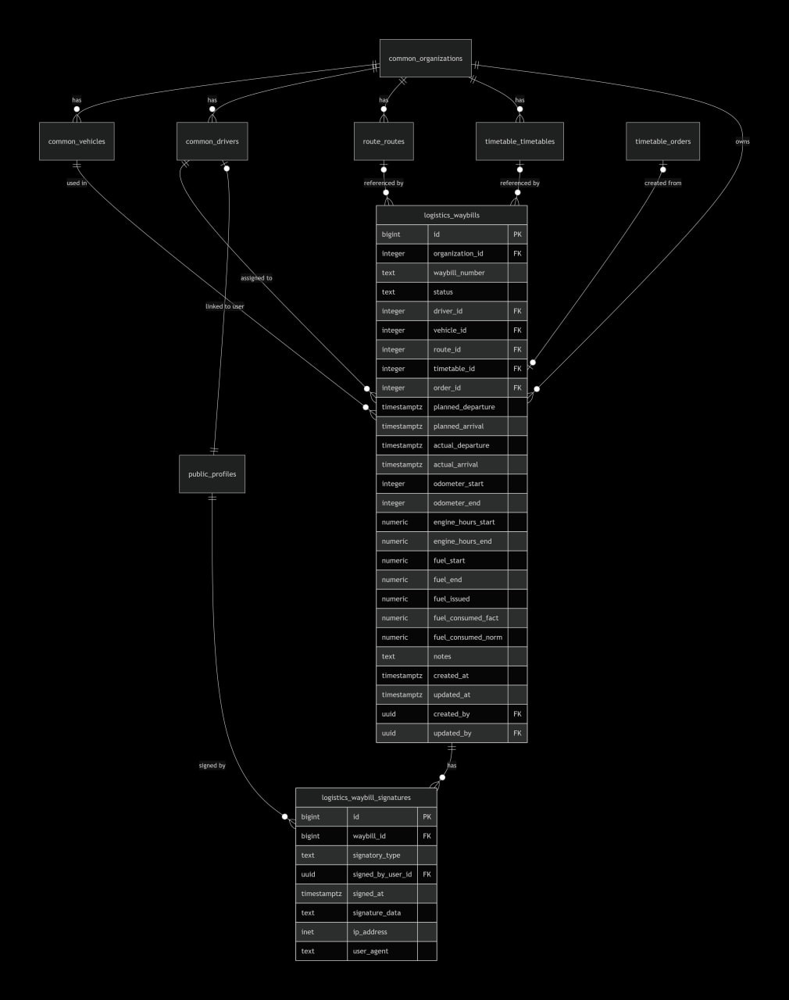
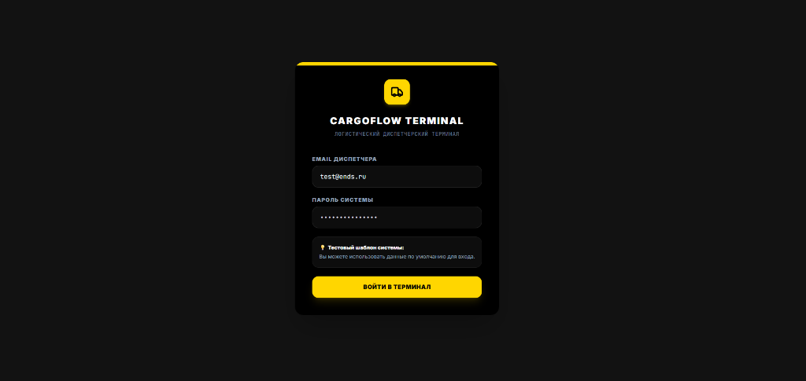
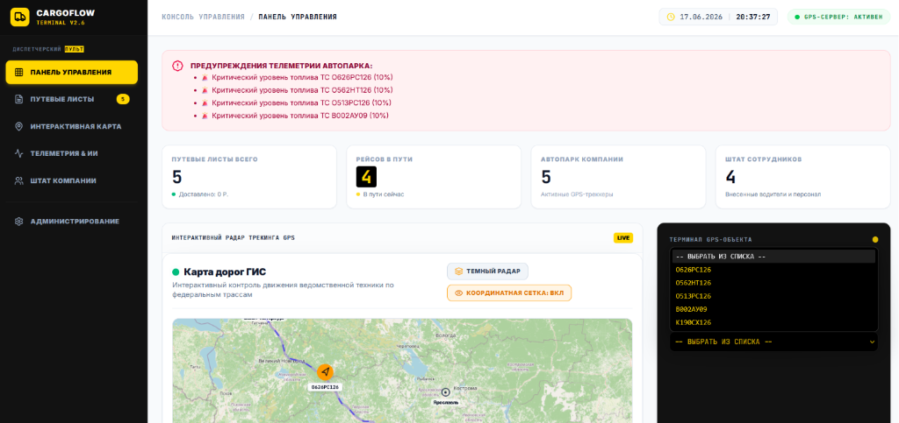
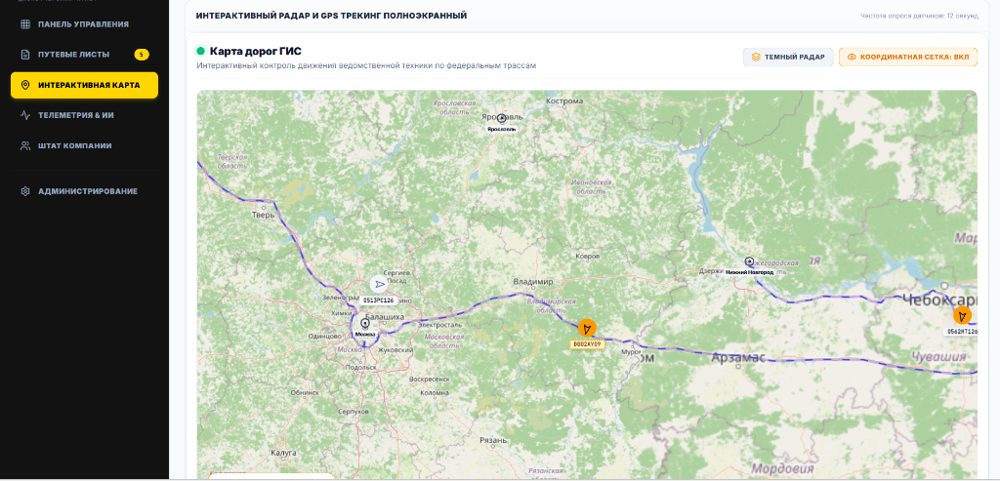
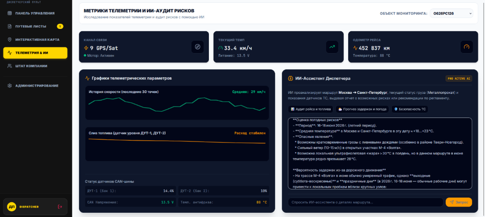
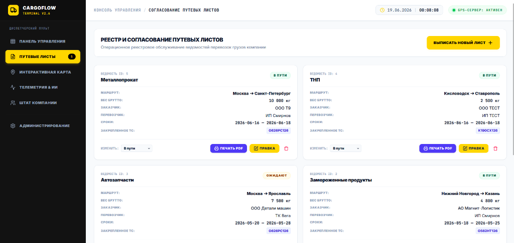
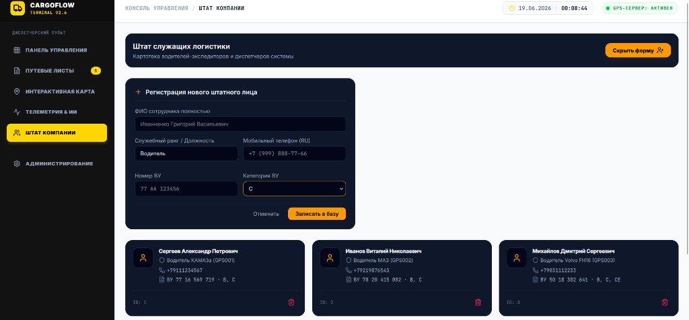

# CargoFlow — Система управления грузоперевозками

Информационная система формирования электронных путевых листов (ЭПЛ) с модулем мониторинга транспортных средств на базе спутниковых данных GPS/ГЛОНАСС и ИИ-аудитом рейсов.

Система предназначена для автоматизации документооборота автотранспортного предприятия: выписка путевых листов, управление штатом водителей, контроль местоположения и состояния транспортных средств в реальном времени, аналитика рейсов с помощью ИИ.

---

## 🌐 Демонстрация и Документация

- 🔗 **[Сайт-презентация проекта (GitHub Pages)](https://01esya.github.io/module/)** — интерактивное описание возможностей и скриншоты интерфейса.
- 📖 **[Документация REST API](API.md)** — детальное описание серверных эндпоинтов, запросов и ответов.
- ⏳ **[История изменений (Changelog)](CHANGELOG.md)** — журнал релизов и версионирования.
- 📄 **[Лицензия MIT](LICENSE)** — правила использования и распространения исходного кода.
- 📚 **[GitHub Wiki проекта](https://github.com/01esya/module/wiki)** — дополнительная база знаний.

---

## Стек технологий

### Frontend

| Назначение | Технология |
|------------|------------|
| UI-фреймворк | React 19 + TypeScript |
| Сборка / dev-сервер | Vite 6 |
| Стили | Tailwind CSS 4 |
| Картография | OpenLayers (`ol`) |
| Анимации | Motion |
| Иконки | lucide-react |

### Backend (порт 8000)

| Назначение | Технология |
|------------|------------|
| API-фреймворк | FastAPI |
| ORM / БД | SQLAlchemy + SQLite |
| HTTP-клиент | httpx |
| Авторизация | PyJWT, bcrypt |
| Rate limiting | SlowAPI |
| Раздача статики | FastAPI StaticFiles (в продакшене) |
| Контейнеризация | Docker (multi-stage build) |
| Тесты | pytest, pytest-asyncio |

### Внешние системы

- **Supabase** (PostgreSQL + PostgREST) — справочники транспортных средств и организаций (с автоматическим локальным демо-режимом при отсутствии сети).
- **OpenRouter** — ИИ-аналитика и аудит рейсов (требуется API-ключ).
- **OpenStreetMap (OSM) / OpenLayers** — интерактивная ГИС-карта мониторинга транспорта (требуется интернет на клиенте для загрузки тайлов, API-ключ не нужен).

---

## Архитектура

```
Разработка:
Браузер :5173 (Vite dev) ── прокси /api ──► FastAPI :8000

Продакшен:
Браузер :8000 ──► FastAPI :8000 (API + статика из dist/)
                    │
                    ├── httpx ──► Supabase (PostgREST)
                    ├── httpx ──► OpenRouter (LLM)
                    ▼
              SQLite (путевые листы, сотрудники, пользователи)
```

Разделение данных по принципу MDM (Master Data Management): справочник транспортных средств ведётся централизованно в Supabase, а транзакционные документы (путевые листы) и штат создаются и хранятся локально в SQLite.

Фронтенд обращается к API по относительным путям (`/api/...`). В режиме разработки Vite проксирует их в FastAPI, в продакшене FastAPI сам отдаёт собранную статику — единый origin в обоих случаях.

### Схема базы данных (ER-диаграмма)
Для визуализации структуры и связей в СУБД спроектирована следующая физическая модель:



> [!NOTE]
> ### 🗄️ Спецификация СУБД и распределенная архитектура данных (MDM)
> 
> Представленная ER-диаграмма визуализирует единую логическую модель данных системы. Физическая реализация использует гибридную архитектуру **Master Data Management (MDM)** для обеспечения отказоустойчивости и автономности:
> 
> * **Физическая структура (SQLite):** Схема полностью соответствует локальной базе данных **SQLite**, развернутой на стороне клиентского терминала (описана ORM-моделями в [models.py](file:///backend/app/models/models.py)). Она содержит все необходимые таблицы для автономной работы, включая локальную таблицу-кэш транспортных средств `vehicles` для поддержки режима *offline-fallback*.
> * **Распределение данных на физическом уровне:**
>   * **Облачная СУБД (PostgreSQL / Supabase):** Хранит мастер-данные общего пользования — единый справочник автопарка (`vehicles`) и учетные данные организаций. Это обеспечивает сквозную синхронизацию парка ТС между всеми филиалами компании.
>   * **Локальная СУБД (SQLite):** Хранит операционные транзакционные данные — реестр путевых листов (`waybills`), цифровые подписи (`waybill_signatures`), штат сотрудников филиала (`employees`) и локальные учетные записи диспетчеров (`users`). Это гарантирует мгновенный отклик интерфейса и непрерывность выписки документов при обрыве интернет-соединения.

---

## 📸 Интерфейс приложения

Ниже представлены ключевые экраны системы:

### 1. Авторизация диспетчера
Форма входа в систему с предзаполненными демо-данными для проверки.


### 2. Панель управления (Dashboard)
Сводная статистика по рейсам, автопарку и предупреждения телеметрии.


### 3. Интерактивная ГИС-карта
Мониторинг движения транспортных средств в реальном времени с прокладкой маршрутов.


### 4. Телеметрия и ИИ-Аналитика
Графики датчиков и аудит рисков рейса с помощью искусственного интеллекта.


### 5. Реестр путевых листов (CRUD)
Управление путевыми листами, смена статусов и печать ЭПЛ в PDF.


### 6. Картотека сотрудников
Регистрация водителей и диспетчеров с валидацией водительских удостоверений.


---

## Установка и запуск

### Требования

- Node.js 18+
- Python 3.12+
- Docker (опционально)

### 1. Backend (FastAPI)

```powershell
cd backend

# Виртуальное окружение
python -m venv .venv
.\.venv\Scripts\Activate.ps1

# Зависимости
pip install -r requirements.txt
```

Создайте файл `backend/.env` (см. `backend/.env.example`):

```env
SUPABASE_URL=https://<адрес-supabase>
SUPABASE_ANON_KEY=<anon-key>
SUPABASE_SERVICE_EMAIL=<email-сервисной-уч-записи>
SUPABASE_SERVICE_PASSWORD=<пароль>
OPENROUTER_API_KEY=<ключ-OpenRouter>
JWT_SECRET=<секрет-для-подписи-JWT-минимум-32-символа>
APP_ENV=development
BACKEND_PORT=8000
FRONTEND_ORIGIN=http://localhost:5173
```

Запуск:

```powershell
cd backend
.\run_server.ps1
```

Swagger UI: http://localhost:8000/docs

### 2. Frontend (из корня проекта)

```powershell
npm install
npm run dev
```

Приложение откроется по адресу: http://localhost:5173

### 3. Docker (альтернативный запуск)

Backend поставляется с multi-stage `Dockerfile` (builder + runtime, non-root user, 3 uvicorn workers).

#### Только Backend

```powershell
cd backend
docker build -t cargoflow-backend .
docker run -p 8000:8000 --env-file .env cargoflow-backend
```

#### Full-stack (с собранным фронтом)

```powershell
# 1. Сборка фронтенда
npm run build

# 2. Сборка Docker-образа
cd backend
docker build -t cargoflow-backend .

# 3. Запуск с монтированием статики
docker run -p 8000:8000 --env-file .env -v "%cd%\..\dist:/app/dist" cargoflow-backend
```

Приложение: http://localhost:8000  
Swagger UI: http://localhost:8000/docs

### Учётные данные по умолчанию

| Поле | Значение |
|------|----------|
| Email | `test@ends.ru` |
| Пароль | `fdp-swf-AdZ-RB7` |

### Продакшен-сборка (без Docker)

```powershell
npm run build                      # собирает dist/
cd backend
.\run_server.ps1                   # FastAPI раздаёт API + статику
```

Приложение доступно на http://localhost:8000.

### 4. Запуск автоматических тестов

Проект укомплектован автотестами для бэкенда и проверками типов для фронтенда.

#### Тесты Backend (pytest)
```powershell
cd backend
# Активация виртуального окружения (если не активировано)
.\.venv\Scripts\Activate.ps1
# Запуск тестов
pytest
```

#### Статический анализ Frontend (TypeScript)
```powershell
# Запуск линтера из корня проекта
npm run lint
```

---

## Структура проекта

```
module/
├── src/                        # Frontend (React 19 + TypeScript)
│   ├── components/
│   │   ├── CargoForm.tsx        # Форма путевого листа
│   │   ├── MapControl.tsx       # Интерактивная карта (OpenLayers)
│   │   ├── AnalyticsPanel.tsx   # Телеметрия и ИИ-аудит
│   │   ├── PersonnelGrid.tsx    # Управление штатом
│   │   └── PrintWaybillModal.tsx # Печать ЭПЛ в PDF
│   ├── App.tsx                  # Главный компонент
│   └── types.ts                 # TypeScript-интерфейсы
│
├── backend/
│   ├── Dockerfile               # Multi-stage Docker-образ
│   ├── app/
│   │   ├── api/                 # FastAPI роутеры
│   │   │   ├── auth.py          # Авторизация (JWT + HttpOnly cookie)
│   │   │   ├── waybills.py      # CRUD путевых листов
│   │   │   ├── employees.py     # CRUD сотрудников
│   │   │   ├── vehicles.py      # ТС (Supabase)
│   │   │   ├── monitoring.py    # Имитация спутниковой GPS/ГЛОНАСС-телеметрии
│   │   │   └── ai.py            # ИИ-аналитика (OpenRouter)
│   │   ├── core/
│   │   │   ├── config.py        # Настройки (Pydantic Settings)
│   │   │   ├── database.py      # SQLite + SQLAlchemy + seed-данные
│   │   │   └── security.py      # bcrypt + rate limiting
│   │   ├── models/
│   │   │   └── models.py        # SQLAlchemy ORM
│   │   ├── services/
│   │   │   ├── local_service.py       # SQLite: путевые листы, сотрудники
│   │   │   ├── supabase_service.py    # Supabase PostgREST: ТС, организации
│   │   │   └── telemetry_simulator.py # Имитация навигационных пакетов
│   │   └── main.py              # Точка входа FastAPI (+ StaticFiles)
│   ├── tests/                   # Интеграционные тесты (pytest)
│   └── requirements.txt
│
├── vite.config.ts              # Vite + прокси /api → FastAPI
└── api.http                    # REST Client: ручное тестирование API
```

---

## Основные функции

- **Путевые листы** — создание, редактирование, смена статуса (Ожидают → В пути → Доставлен), печать в PDF
- **Мониторинг** — отображение ТС на интерактивной карте (OpenLayers), обновление координат каждые 12 секунд
- **Телеметрия** — скорость, уровень топлива, спутники GPS в реальном времени
- **ИИ-аудит** — анализ рейса через OpenRouter (LLM): оценка рисков состояния водителя и ТС
- **Штат** — картотека водителей и диспетчеров с номерами водительских удостоверений
- **MDM-архитектура** — справочник ТС в Supabase, операционные данные в локальном SQLite
