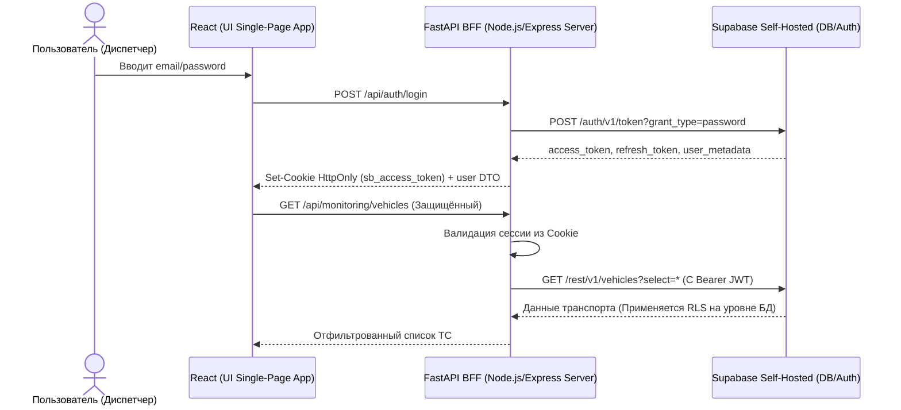
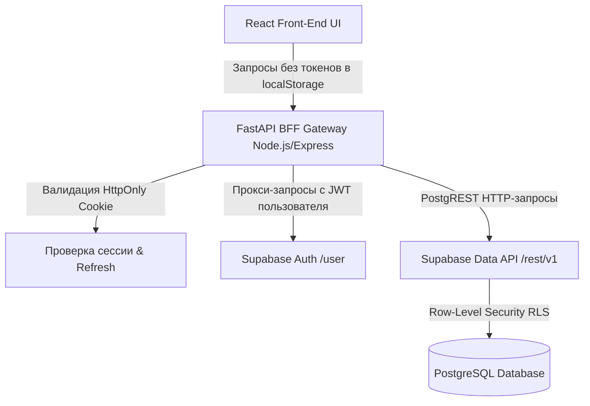

# Сервис электронных путевых листов с модулем телеметрии и ИИ аналитики

Этот документ содержит техническое описание, архитектурное руководство, бизнес-требования и инструкции по развёртыванию дипломного проекта.

---

## 1. Бизнес-требования и Цели

### Проблема
Управление парком коммерческого транспорта и оформление путевых листов традиционно сопровождается высоким объёмом ручной бумажной работы, рисками фальсификации пробега, перерасхода топлива и сложностью своевременного выявления технических неисправностей.

### Решение
Единое цифровое пространство, связывающее:
- **Учёт путевых листов** (оформление, диспетчеризация, статусы погрузки/выгрузки, печать по ГОСТ).
- **Прямой мониторинг транспорта** (интеграция с телематическими устройствами ГЛОНАСС/GPS).
- **Интеллектуальный аудит** (выявление аномалий слива топлива, превышения скорости и нецелевого использования с помощью локальной большой языковой модели AI-аналитика).

---

## 2. Архитектура Системы (BFF Pattern)

Система построена по паттерну **Backend-for-Frontend (BFF)**:



### Диаграмма компонентов



---

## 3. Детализация разделов приложения

### 3.1. Панель управления (Dashboard)
Основной рабочий экран диспетчера для оперативного мониторинга парка и путевых листов.

**Ключевые блоки диспетчерской панели:**
*   **Карта мониторинга**: Интеграция с картографической подложкой, отображающая текущее геоположение грузовиков в реальном времени.
*   **Реестр путевых листов**: Полнофункциональная CRUD-таблица с фильтрацией по автомобилям, водителям и статусу рейса (`Черновик`, `В пути`, `Выгружен`, `Подтвержден`).
*   **Печатные формы**: Генератор печатной формы путевого листа согласно Приказу Минтранса РФ № 390 с автоматическим форматированием инициалов должностных лиц.
*   **Штат компании**: Подраздел управления водителями и диспетчерами.

### 3.2. Модуль "Телеметрия & ИИ"
Интеллектуальный помощник для автоматизированного анализа логов и параметров движения.

**Возможности модуля:**
*   **Графики датчиков**: Интерактивная отрисовка графиков уровня топлива, напряжения бортовой сети и скорости.
*   **Интеграция с LLM (Gemini AI)**: Контекстный анализатор параметров, аргументированно выявляющий простои при запущенном двигателе, подозрительные скачки расхода горючего или необоснованные отклонения от маршрута.

---

## 4. Контракт Supabase API (на основе api.http)

Все вызовы ко внешнему бэкенду Supabase строго специфицированы по контракту из файла `api.http`:

*   **Авторизация и получение сессии**
    `POST <SUPABASE_URL>/auth/v1/token?grant_type=password`
*   **Проверка токена и профиль**
    `GET <SUPABASE_URL>/auth/v1/user`
*   **Запрос ТС**
    `GET <SUPABASE_URL>/rest/v1/vehicles?select=*&order=id.asc`
*   **История мониторинга за период**
    `POST <SUPABASE_URL>/rest/v1/rpc/get_monitoring_records`
    ```json
    {
      "p_vehicle_id": 4,
      "p_from": "2026-03-18T00:00:00Z",
      "p_to": "2026-03-25T00:00:00Z",
      "p_limit": 50,
      "p_offset": 0
    }
    ```

---

## 5. Инструкции по локальной установке и запуску

### 5.1. Настройка переменных окружения

Создайте `.env` файл в корневом каталоге проекта:

```env
# URL Вашего self-hosted инстанса Supabase
SUPABASE_URL=https://194-67-127-185.cloudvps.regruhosting.ru
SUPABASE_ANON_KEY=eyJhbGciOiJIUzI1NiIsInR5cCI6IkpXVCJ9...

# Конфигурация cookies для безопасности сессий
COOKIE_SECURE=false
COOKIE_SAMESITE=lax
FRONTEND_ORIGIN=http://localhost:3000
```

### 5.2. Команды для запуска

```bash
# Установка зависимостей
npm install

# Запуск в режиме разработки (Back-end + Front-end Vite)
npm run dev

# Сборка проекта для продакшна
npm run build

# Запуск продакшн сборки
npm run start
```
