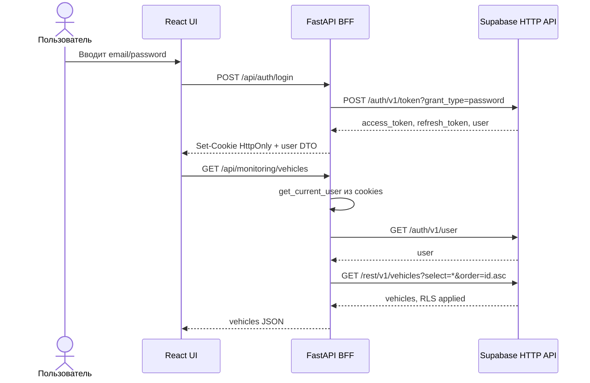
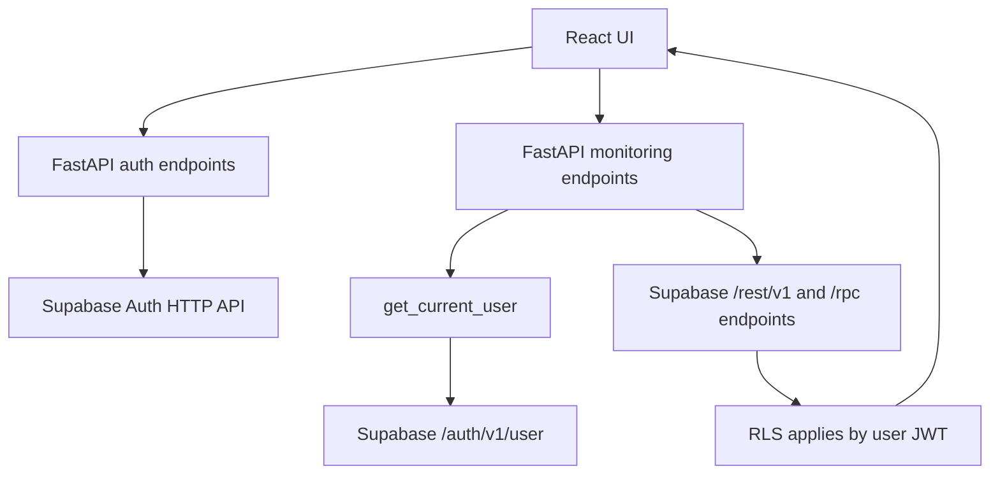

# CargoFlow FastAPI Backend

FastAPI is the backend-for-frontend for the React UI. Supabase Auth is the single authorization source, and `F:\legacy\waybill-module_1\api.http` is the Supabase HTTP API contract.

## How Auth Works

- React sends `email/password` to `POST /api/auth/login`.
- FastAPI calls Supabase HTTP directly with `httpx`: `POST /auth/v1/token?grant_type=password`.
- FastAPI stores `access_token` and `refresh_token` in HttpOnly cookies: `sb_access_token`, `sb_refresh_token`.
- React receives only a user DTO plus a non-secret compatibility marker.
- Protected FastAPI endpoints call `GET /auth/v1/user` with `Authorization: Bearer <user access token>`.
- Supabase REST/RPC requests always use `apikey` and `Authorization: Bearer <user access token>`, so RLS applies in Supabase.





## Run

```powershell
cd F:\cargoflow\backend
python -m pip install -r requirements.txt
copy .env.example .env
python -m uvicorn app.main:app --reload --port 8000
```

Required env:

```env
SUPABASE_URL=https://194-67-127-185.cloudvps.regruhosting.ru
SUPABASE_ANON_KEY=replace_me
FRONTEND_ORIGIN=http://localhost:5173,http://localhost:3000
COOKIE_SECURE=false
COOKIE_SAMESITE=lax
```

## Manual Checks

```powershell
# login, cookies are written to cookies.txt
curl.exe -c cookies.txt -b cookies.txt -H "Content-Type: application/json" `
  -d "{\"email\":\"test@ends.ru\",\"password\":\"fdp-swf-AdZ-RB7\"}" `
  http://127.0.0.1:8000/api/auth/login

curl.exe -c cookies.txt -b cookies.txt http://127.0.0.1:8000/api/auth/me
curl.exe -c cookies.txt -b cookies.txt http://127.0.0.1:8000/api/monitoring/vehicles

curl.exe -c cookies.txt -b cookies.txt -H "Content-Type: application/json" `
  -d "{\"vehicle_id\":4,\"from\":\"2026-03-18T00:00:00Z\",\"to\":\"2026-03-25T00:00:00Z\",\"limit\":5,\"offset\":0}" `
  http://127.0.0.1:8000/api/monitoring/records

curl.exe -c cookies.txt -b cookies.txt -X POST http://127.0.0.1:8000/api/auth/logout
curl.exe -c cookies.txt -b cookies.txt http://127.0.0.1:8000/api/auth/me
```

## Implemented Supabase Contract

- `POST /auth/v1/token?grant_type=password`
- `POST /auth/v1/token?grant_type=refresh_token`
- `GET /auth/v1/user`
- `GET /rest/v1/device_types?select=*`
- `GET /rest/v1/parameters?select=*&order=code.asc`
- `GET /rest/v1/organizations?select=*`
- `GET /rest/v1/profiles`
- `GET /rest/v1/vehicles?select=*&order=id.asc`
- `GET /rest/v1/vehicles?select=*&id=eq.{vehicle_id}`
- `GET /rest/v1/vehicles?select=*&active=eq.true&order=id.asc`
- `GET /rest/v1/navigation_devices?select=*&order=id.asc`
- `GET /rest/v1/vehicle_devices?...`
- `GET /rest/v1/user_vehicles?...`
- `POST /rest/v1/rpc/get_monitoring_records`
