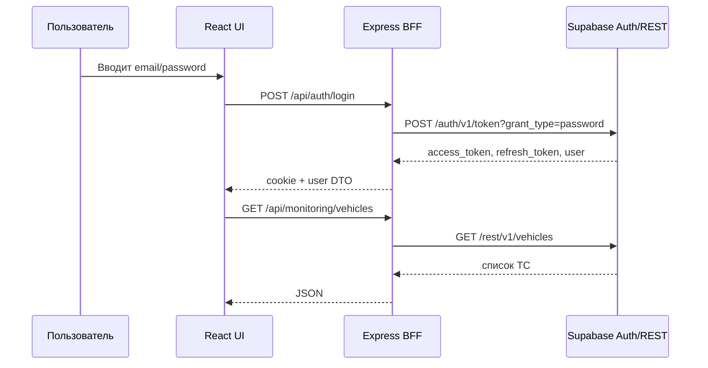

# Архитектура проекта CargoFlow

## 1. Текущее состояние

Проект сейчас работает как:

- Frontend: React + Vite + TypeScript
- Backend/BFF: Node.js + Express
- Data/Auth: Supabase (Auth + REST API)

Текущая реализация находится в:

- [server.ts](../server.ts)
- [supabase_http.ts](../supabase_http.ts)
- [src/App.tsx](../src/App.tsx)

## 2. Как сейчас устроен поток

## 3. Что делает фронтенд

Frontend отвечает за:

- экран входа и авторизацию;
- отображение панелей: dashboard, loads, monitoring;
- карты, телеметрию и управление грузами;
- запросы через REST API BFF.

Ключевой файл:

- [src/App.tsx](../src/App.tsx)

## 4. Что делает бэкенд сейчас

Бэкенд на Express выполняет:

- авторизацию через Supabase;
- cookie-based session handling;
- проксирование запросов к Supabase;
- локальный fallback для демо/разработки;
- генерацию имитации GPS/телеметрии.

Ключевые файлы:

- [server.ts](../server.ts)
- [supabase_http.ts](../supabase_http.ts)

## 5. Где уместен FastAPI

FastAPI можно добавить как второй backend-сервис, если нужно:

- настоящая бизнес-логика;
- строгая валидация Pydantic;
- чистая REST-архитектура;
- сценарии для отчётов, печати путевых листов, аналитики.

Рекомендуемая схема:

- Express/BFF — для UI, cookies, auth bridge, прокси к Supabase;
- FastAPI — для сложной логики и сервисов.

## 6. Рекомендуемый итоговый вариант

Оптимальная архитектура для этого проекта:

1. React frontend
2. Express BFF (для текущего быстрого старта)
3. FastAPI service (для будущей бизнес-логики)
4. Supabase как база/авторизация

Это даёт:

- быстрый запуск;
- понятный UI слой;
- возможность позже выделить чистый backend.
